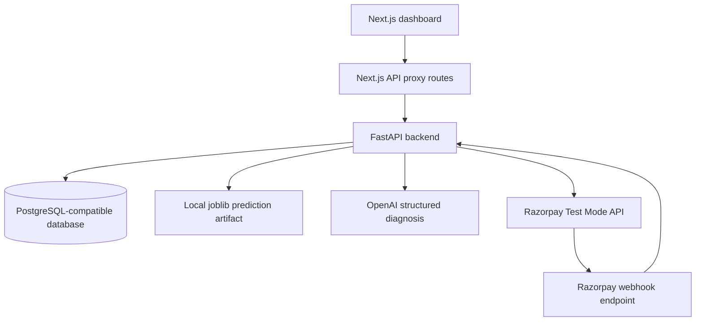
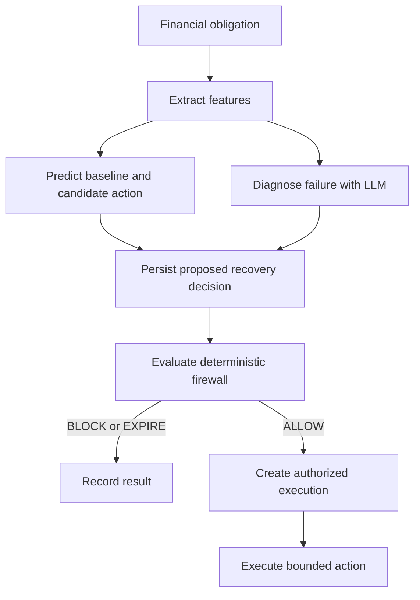
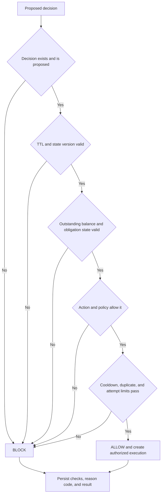
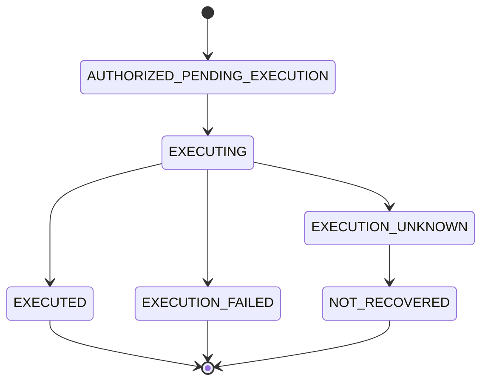

# Pulse

Pulse is an AI-powered revenue recovery and financial control platform for payment obligations.

[Watch the video demo](https://drive.google.com/file/d/1hQ0FsB7_m-lAIpL1jfbCvTB_dbmoI4AC/view)

## Problem

Failed and unfinished payments create revenue leakage. Blindly retrying a payment can duplicate customer contact, violate merchant policy, or trigger an action after the financial state has changed. Recovery needs current financial state, bounded policy, and an enforceable control point before an external payment action.

## Solution

Pulse turns recovery into a controlled loop:

```text
Obligation
  -> Feature Extraction
  -> Prediction
  -> AI Diagnosis
  -> Recovery Decision
  -> Deterministic Policy
  -> Runtime Firewall
  -> Bounded Execution
  -> Razorpay Payment Link
  -> Reconciliation
```

## Why Pulse

Pulse separates recommendation from authorization:

> AI proposes. Deterministic controls authorize.

The prediction model estimates recovery outcomes and the LLM provides structured failure diagnosis. Neither can authorize a financial action. The deterministic recovery policy and runtime firewall validate state, amount, action, timing, and execution limits before a server-side Razorpay request is made.

## Core Features

- Revenue-at-risk views over financial obligations
- Deterministic recovery feature extraction
- Recovery probability prediction with a versioned scikit-learn model artifact
- Structured AI failure diagnosis
- Persisted recovery decisions with model and feature versions
- Deterministic recovery policy controls
- Runtime firewall evaluation with recorded checks and reason codes
- Bounded server-side execution
- Razorpay Payment Link creation in Test Mode
- Verified Razorpay webhook ingestion and event processing
- Recovery execution tracking
- Reconciliation for unknown executions
- Decision, firewall, and execution audit trail
- Policy configuration through the dashboard

## Architecture

### High-level system architecture



### Recovery decision lifecycle



### Runtime firewall decision flow



### Execution lifecycle



## Safety Model

The firewall is the authorization boundary. It checks:

- Decision status and decision TTL, currently 60 minutes
- Expected versus current obligation state version
- Positive outstanding amount
- Eligible obligation state
- Registered and enabled recovery action
- Enabled policy and allowed actions
- Maximum autonomous amount and optional human approval requirement
- Cooldown between recovery executions
- Duplicate active action prevention
- Maximum action attempts per obligation

Unexpected firewall validation errors fail closed as `BLOCK`. An allowed decision creates one execution record with a unique decision-linked idempotency key. Execution performs another state, balance, action, policy, and currency validation before calling Razorpay. `EXECUTION_UNKNOWN` records can be reconciled; the current reconciler waits for webhook evidence and moves an expired unknown execution to `NOT_RECOVERED` after its configured window.

## Razorpay Integration

Pulse uses Razorpay Test Mode credentials from the backend environment. After the firewall returns `ALLOW`, the backend can create a Payment Link for the outstanding INR amount. The response stores the Razorpay reference, Payment Link identifier, and short URL on the execution record.

This prototype does not claim to move real money. Razorpay webhook signatures are verified before events are persisted. Webhook events are processed asynchronously to update payment attempts, obligation state, and recovery attribution.

## AI Layer

The recovery model is a versioned scikit-learn `LogisticRegression` pipeline trained from the repository's recovery training data and saved as a `.joblib` artifact. It predicts a probability for the baseline and each eligible candidate action.

The OpenAI integration produces a structured diagnosis containing a failure category, diagnostic confidence, evidence, and uncertainty. Diagnosis is advisory. If the LLM is unavailable, Pulse records an explicit uncertain diagnosis and continues with the deterministic policy and prediction result. The LLM does not select an authorized action, change policy, or call Razorpay.

## AI Usage Report

This project was built with a multi-model AI workflow to speed up design, implementation, debugging, and review across the stack:

- Gemini 3.1 Pro — product and architecture reasoning
- Gemini 3.8 Flash — rapid iteration and quick prototyping
- GPT Luna 5.6 — the model used in the current VS Code Copilot workflow for implementation support
- Claude Opus — high-level design review and strategic problem solving
- Claude Sonnet 4.6 — day-to-day coding, refactoring, and debugging

The AI layer was used as a builder and accelerator, but the financial control logic, runtime firewall, and policy enforcement remain deterministic and authoritative. This keeps the system aligned with the safety-first design requirement for autonomous recovery decisions.

## Dashboard

The Next.js dashboard provides:

- **Overview**: recovery performance, revenue at risk, obligation state, and service health
- **Obligations**: financial obligations and payment timelines
- **Recovery**: eligible recovery candidates, prediction, diagnosis, firewall evaluation, and execution flow
- **Decisions**: proposed decisions and decision-to-firewall-to-execution audit information
- **Executions**: execution status, Razorpay references, Payment Link URLs, and unknown-execution reconciliation
- **Events**: persisted Razorpay webhook processing status and timestamps
- **Policies**: enabled state, autonomous amount limit, action limit, cooldown, allowed actions, and human approval threshold

## Tech Stack

### Backend

- Python
- FastAPI and Uvicorn
- SQLAlchemy 2 with async sessions
- PostgreSQL-compatible database support through `asyncpg`
- Alembic migrations
- Pydantic Settings
- Razorpay Python SDK
- scikit-learn, pandas, SciPy, and joblib
- OpenAI Python SDK
- pytest, pytest-asyncio, and httpx

### Frontend

- Next.js 16 App Router
- React 19
- TypeScript
- Tailwind CSS 4 and the existing project CSS design tokens
- Next.js server-side API proxy routes for browser mutations

## Project Structure

```text
backend/
  api/                 FastAPI route modules
  artifacts/models/    Versioned local joblib model artifacts
  alembic/             Database migrations
  events/              Event processing logic
  integrations/        Razorpay client integration
  services/            Feature, model, decision, firewall, execution, and reconciliation services
  webhooks/            Razorpay webhook ingestion
  models.py            SQLAlchemy database models
  config.py            Environment-backed settings
  main.py              FastAPI application
  requirements.txt     Python dependencies
frontend/
  app/                 Next.js pages, route handlers, and global styles
  components/          Dashboard and recovery components
  features/            Dashboard feature components
  lib/                 API client and frontend utilities
  types/               TypeScript API contracts
```

## Running Locally

### Backend

From the repository root:

```bash
python -m venv venv
```

Windows:

```powershell
venv\Scripts\activate
pip install -r backend/requirements.txt
uvicorn backend.main:app --reload
```

macOS or Linux:

```bash
source venv/bin/activate
pip install -r backend/requirements.txt
uvicorn backend.main:app --reload
```

The backend listens on `http://127.0.0.1:8000` by default. Run migrations when using a new database:

```bash
alembic -c backend/alembic.ini upgrade head
```

### Frontend

In a second terminal:

```bash
cd frontend
npm install
npm run dev
```

Open `http://localhost:3000`.

### Environment variables

Create a backend `.env` file without committing it:

```env
DATABASE_URL=postgresql+asyncpg://<user>:<password>@<host>:<port>/<database>
RAZORPAY_KEY_ID=<razorpay-test-key-id>
RAZORPAY_KEY_SECRET=<razorpay-test-key-secret>
RAZORPAY_WEBHOOK_SECRET=<razorpay-webhook-secret>
OPENAI_API_KEY=<openai-api-key>
OPENAI_BASE_URL=<optional-openai-compatible-base-url>
LLM_MODEL=<optional-model-name>
```

`OPENAI_BASE_URL` and `LLM_MODEL` are optional. The backend has defaults for the LLM model and OpenAI base URL. The local model artifact is loaded from `backend/artifacts/models/` through the active `RecoveryModelVersion` record.

For the frontend, set the server-only backend URL when the backend is not local:

```env
BACKEND_URL=http://127.0.0.1:8000
```

The browser uses same-origin Next.js proxy routes for recovery mutations. Do not put backend credentials, `OPENAI_API_KEY`, Razorpay secrets, or `BACKEND_URL` in `NEXT_PUBLIC_*` variables.

## Deployment

- **Frontend**: deploy `frontend/` to Vercel.
- **Backend**: deploy the FastAPI application to Render with `uvicorn backend.main:app`.
- **Database**: use the PostgreSQL-compatible database configured by `DATABASE_URL`.
- **Razorpay**: configure Test Mode credentials and a verified webhook endpoint.

Set the Vercel environment variable:

```env
BACKEND_URL=https://<render-backend-url>
```

The production request path is:

```text
Browser -> Vercel Next.js /api proxy -> BACKEND_URL -> Render FastAPI backend
```

Keep OpenAI, database, Razorpay, and webhook secrets only in the backend environment. The backend must also have access to the versioned model artifact used by the active `RecoveryModelVersion`.

## Demo Flow

1. Show revenue at risk in Overview.
2. Open a recovery candidate.
3. Generate a recovery decision.
4. Show the prediction and structured diagnosis.
5. Evaluate the decision with the firewall.
6. Show `ALLOW` and the policy checks.
7. Execute Recovery.
8. Show the Razorpay Payment Link in Test Mode.
9. Open Executions.
10. Show execution status and the decision audit trail.
11. Open Events to show webhook processing.
12. Open Policies to show the controls used by the firewall.

## Engineering Decisions

- The LLM is advisory so diagnosis failure cannot authorize a financial action.
- Policy is deterministic and reviewable.
- The firewall sits between recommendation and execution.
- Execution is server-side so Razorpay credentials are not exposed to the browser.
- Webhooks are asynchronous events and are persisted before background processing.
- Unique event, execution, and idempotency fields prevent duplicate side effects.

## Limitations

- Razorpay integration is configured for Test Mode and is not a production money-movement system.
- Recovery model artifacts are local files and must be packaged or mounted wherever the backend runs.
- The current reconciler does not query Razorpay for an unknown reference; it waits for webhook evidence and applies its expiration policy.
- Historical customer features are limited by the fields currently persisted in the database.
- Authentication and tenant isolation are not implemented as a complete production access-control layer.
- The dashboard is an operational prototype and does not replace production monitoring, secrets management, or incident response.